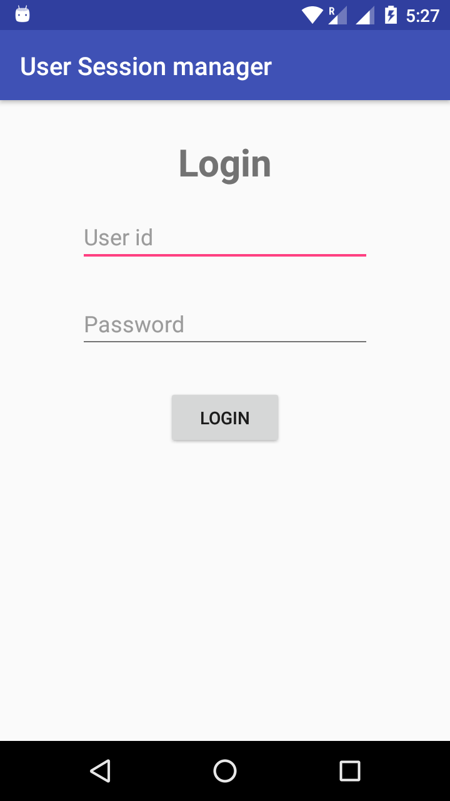
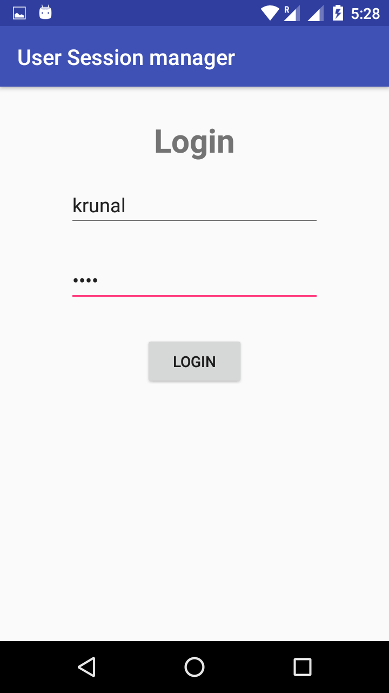
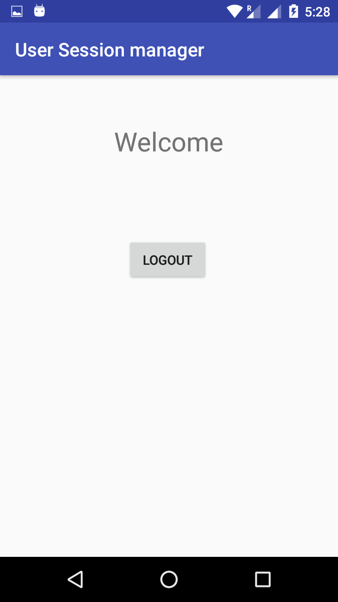

# UserSession Management for login.

UserSession Management using Shared Preferences for login.This is simple example of Shared Preferences.
It show's how to manage session of user login.

## Screenshots:-

  
